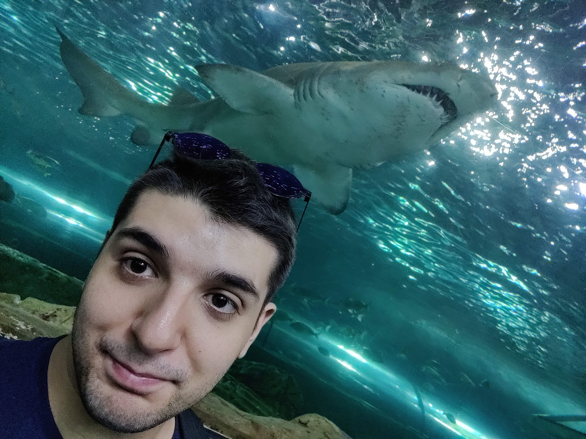

# AN EXPERIENCE TO CHANGE MY LIFE!

## **Hello all**, I am Nicolo' Pasian and I come from Venice, Italy!
I am a Marine Biologist, I studied at University of Bologna for my Bachelor Degree, at University of Padua for my Master Degree and I did my internship program as Assistant Researcher at Macquarie University in Sydney, Australia where I studied the social behaviour and interactions in reef manta ray!

## **My hobbies, they help you every day!"
I have a couple of hobbies that they following me since I was child! The biggest are the videogames, I'm a longtime Playstation player (currently in love with my Playstation 5) but I also am scuba diver, with a certification and maxx deep of 18 meters (down there it's cold). In Italy I played handball.

## **Is time to improve my skills!**
Now, after I graduated in November 2020, I choose to improve myself, in fact I will do the course of Web and Mobile App Development at Cornerstone to be more competitive in the future! One of my first thing is that could help me to obtain a PhD in Marine Biology! Crossing fingers!

